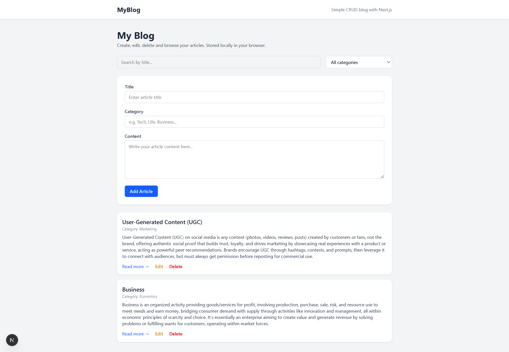
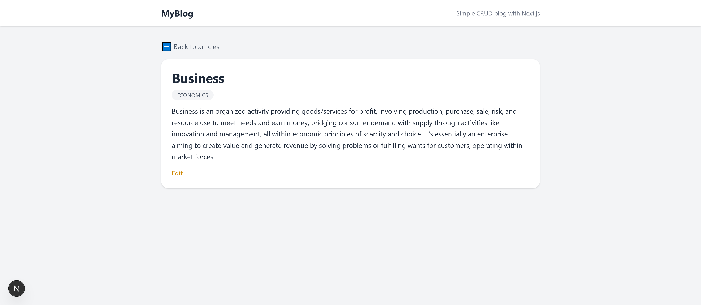
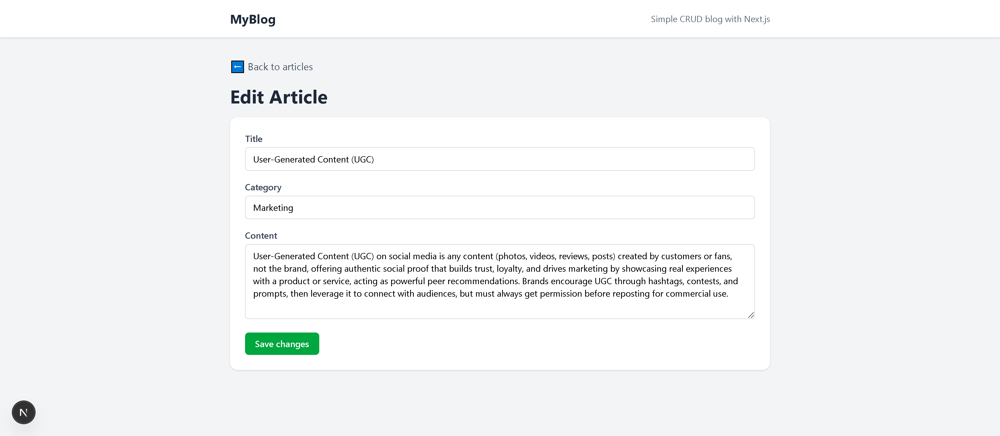
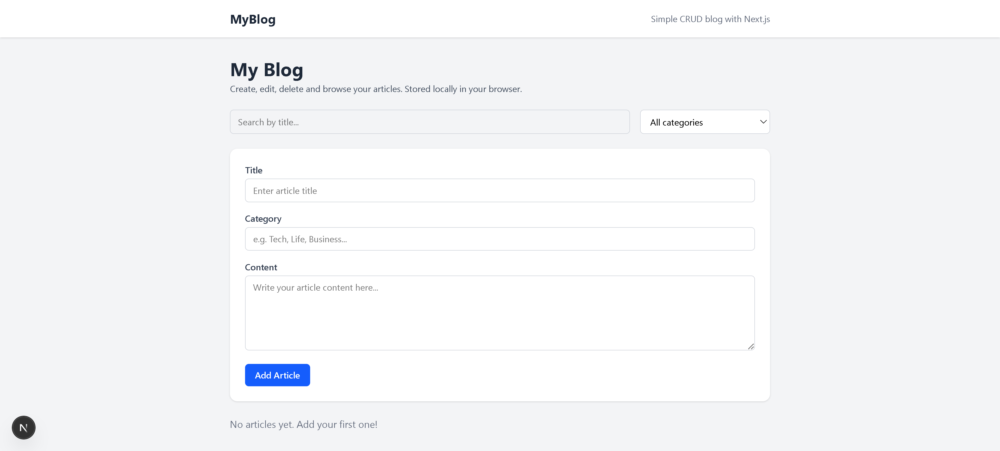

# 📝 MyBlog — Simple CRUD Blog with Next.js


A clean and simple **CRUD Blog App** built using **Next.js (App Router)**,  
**React**, **TypeScript**, and **Tailwind CSS** .
The application implements full CRUD functionality on the client side,
with all data persisted in the browser using localStorage (no backend).
Users can create, read, update, delete, search, and filter articles instantly
without any server interaction.
Despite its simplicity, the project emphasizes clean separation between UI components
and data-handling logic to improve readability and maintainability.

---

## 🚀 Features

### 🧾 Create, Read, Update, Delete (CRUD)
- Add new articles  
- View full article details  
- Edit existing articles  
- Delete articles  
- All data saved in `localStorage` (no backend needed)

### 🔍 Search & Category Filter
- Search by title (case-insensitive)
- Dynamic category filter (categories generated from user input)
- Instant filtering without reload

### 🧭 Global Layout (Navbar)
- Consistent header across all pages
- Clean, simple design (Next.js App Router layout)

### 📄 Article Details Page
- View title, category, and full content
- Styled detail page with "Back to articles" link

### ✏️ Edit Page
- Form pre-filled with the article’s original data
- Save changes instantly to localStorage

### 🎨 UI & Styling
- Fully responsive layout
- Tailwind CSS modern design
- Clean spacing and components

---

## 🗂 Project Structure & Architecture

The project follows the **Next.js App Router** pattern with a clear separation of concerns.

- `app/`  
  - Page routes and layouts using the App Router.
  - Each route handles UI and page-specific state only.

- `app/articles/[id]`  
  - Displays full article details.

- `app/articles/edit/[id]`  
  - Handles article editing with pre-filled form data.

- `lib/articles.ts`  
  - Centralized business logic for:
    - Reading articles from `localStorage`
    - Creating new articles
    - Updating existing articles
    - Deleting articles
  - Keeps storage logic out of UI components.

- `types/article.ts`  
  - Shared TypeScript type definitions used across the app.
  - Ensures type safety and consistency.

### Architectural Decisions

- Business logic is extracted into reusable utility functions instead of being duplicated inside pages.
- UI components focus only on rendering and user interaction.
- Types are centralized to avoid duplication and improve maintainability.
- The app avoids unnecessary abstraction to stay simple and readable.

This structure improves readability, scalability, and makes the project easy to reason about during maintenance or future expansion.

---

## 🛠 Tech Stack
- **Next.js**
- **React**
- **TypeScript**
- **Tailwind CSS**
- **localStorage API**

---

## 📸 Screenshots

### 🏠 Home Page  


### 🧾 Article Details  


### ✏️ Edit Article  


### 🗑 Empty / No Articles  


---

## ▶️ Run Locally

```bash
git clone https://github.com/ahmadashraf7x/myblog-nextjs.git
cd myblog-nextjs
npm install
npm run dev
```

### 🌍 Live Demo 

🚀 https://myblog-nextjs-psi.vercel.app 

### 📌 Author
**Ahmad Ashraf**

Front-End Developer

