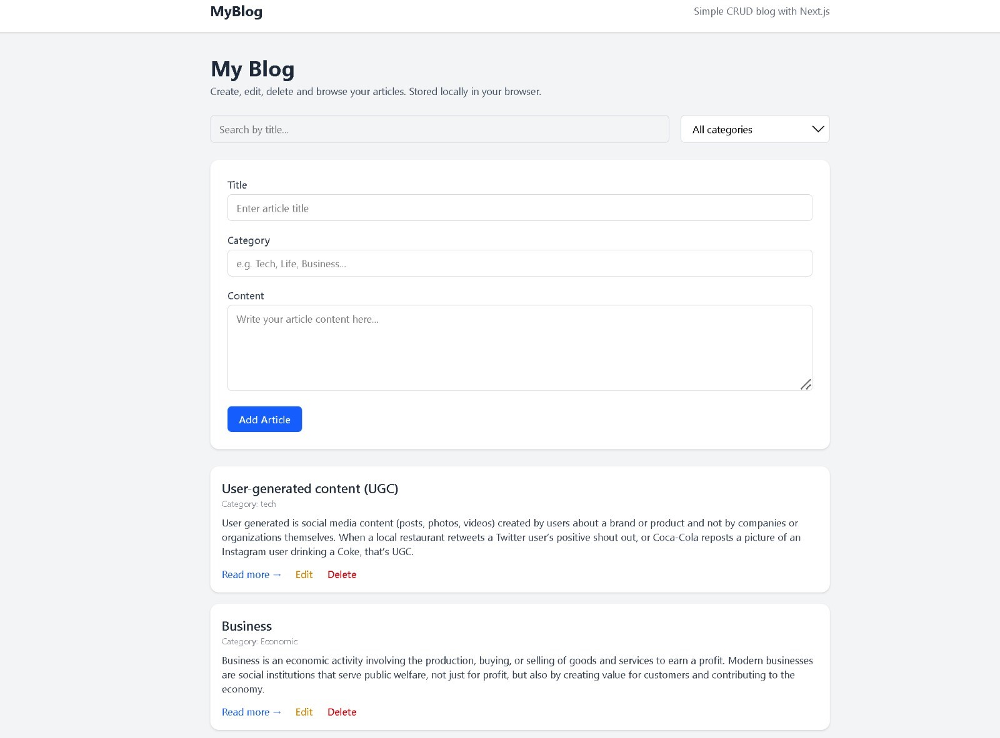
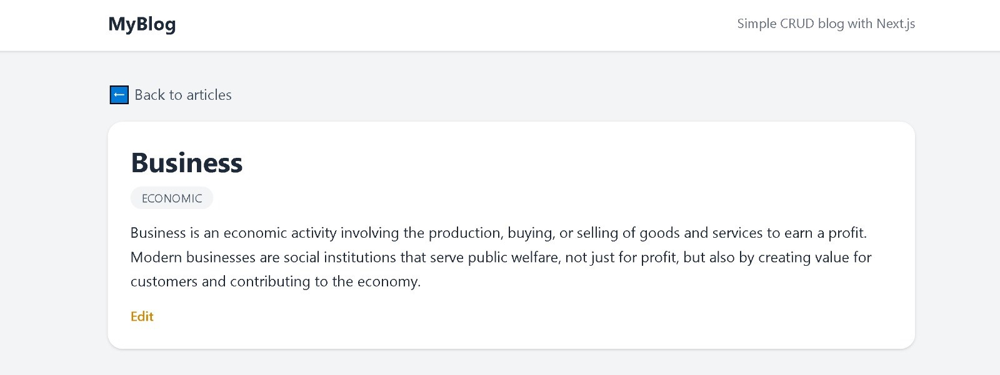
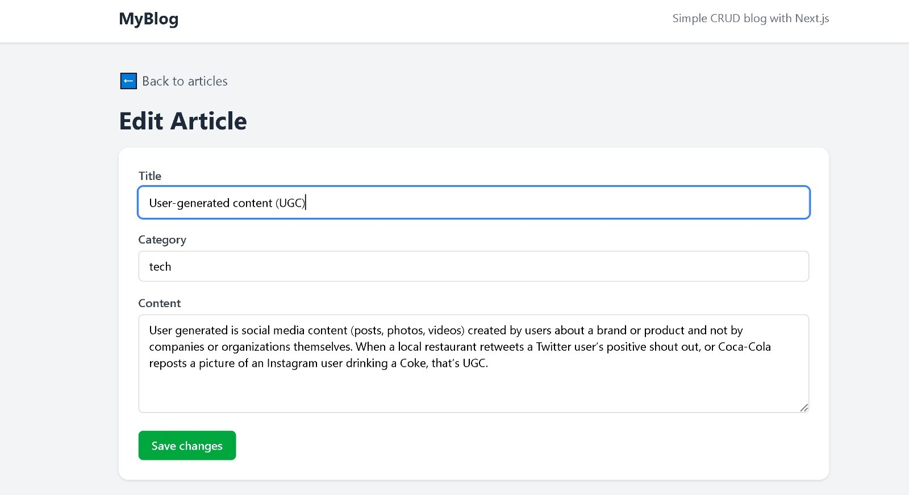
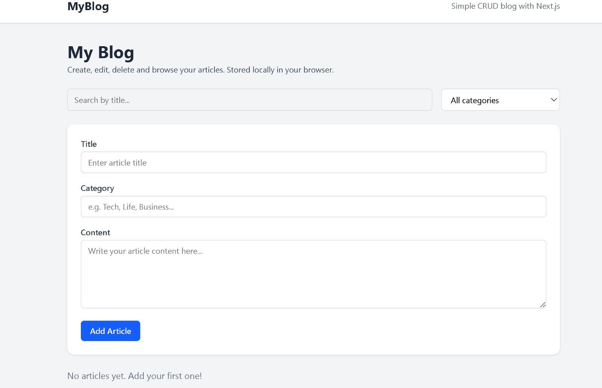

# 📝 MyBlog — Simple CRUD Blog with Next.js


A clean and simple **CRUD Blog App** built using **Next.js 16 (App Router)**,  
**React**, **TypeScript**, and **Tailwind CSS** — fully stored in the browser using `localStorage`.

Create, read, update, delete, search, and filter articles — everything runs on the client side.

---

## 🚀 Features

### 🧾 Create, Read, Update, Delete (CRUD)
- Add new articles  
- View full article details  
- Edit existing articles  
- Delete articles  
- All data saved in `localStorage` (no backend needed)

### 🔍 Search & Category Filter
- Search by title (case-insensitive)
- Dynamic category filter (categories generated from user input)
- Instant filtering without reload

### 🧭 Global Layout (Navbar)
- Consistent header across all pages
- Clean, simple design (Next.js App Router layout)

### 📄 Article Details Page
- View title, category, and full content
- Styled detail page with "Back to articles" link

### ✏️ Edit Page
- Form pre-filled with the article’s original data
- Save changes instantly to localStorage

### 🎨 UI & Styling
- Fully responsive layout
- Tailwind CSS modern design
- Clean spacing and components

---

## 🛠 Tech Stack
- **Next.js 16.0.6 (App Router)**
- **React**
- **TypeScript**
- **Tailwind CSS**
- **localStorage API**
- 100% client-side CRUD logic

---

## 📸 Screenshots

### 🏠 Home Page  


### 🧾 Article Details  


### ✏️ Edit Article  


### 🗑 Empty / No Articles  


---

## ▶️ Run Locally

```bash
git clone https://github.com/ahmadashraf7x/myblog-nextjs.git
cd myblog-nextjs
npm install
npm run dev
```